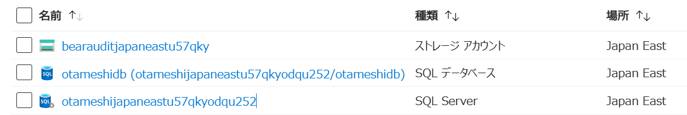
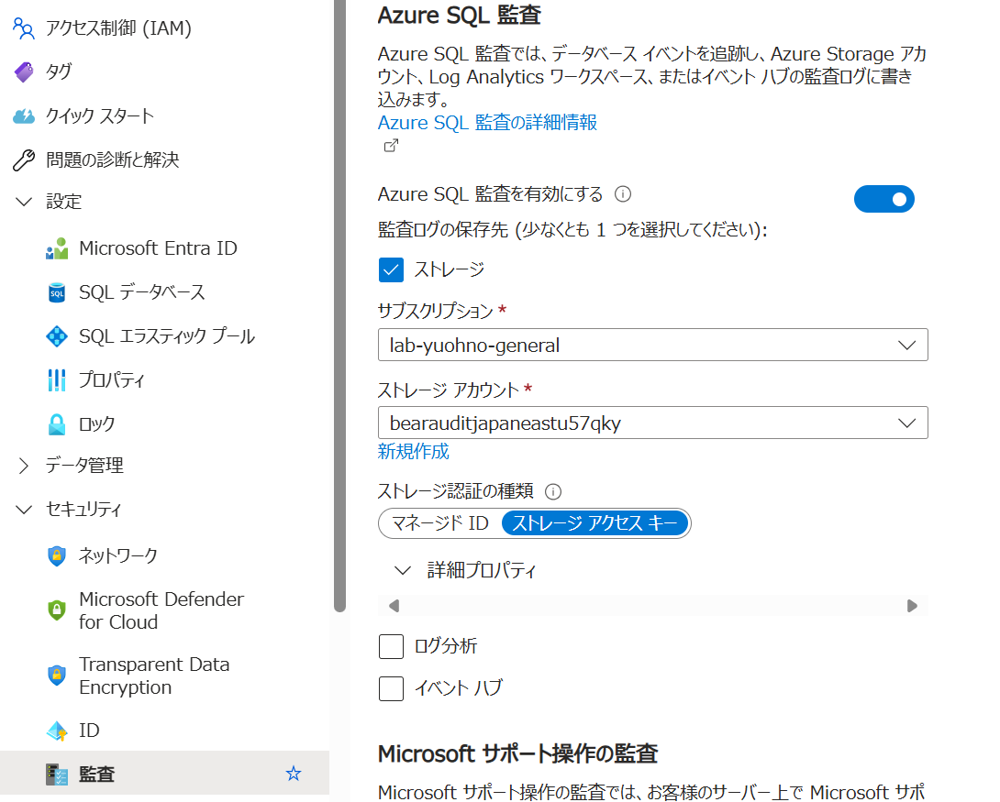
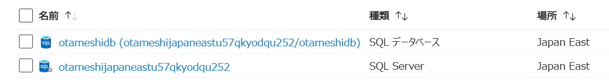
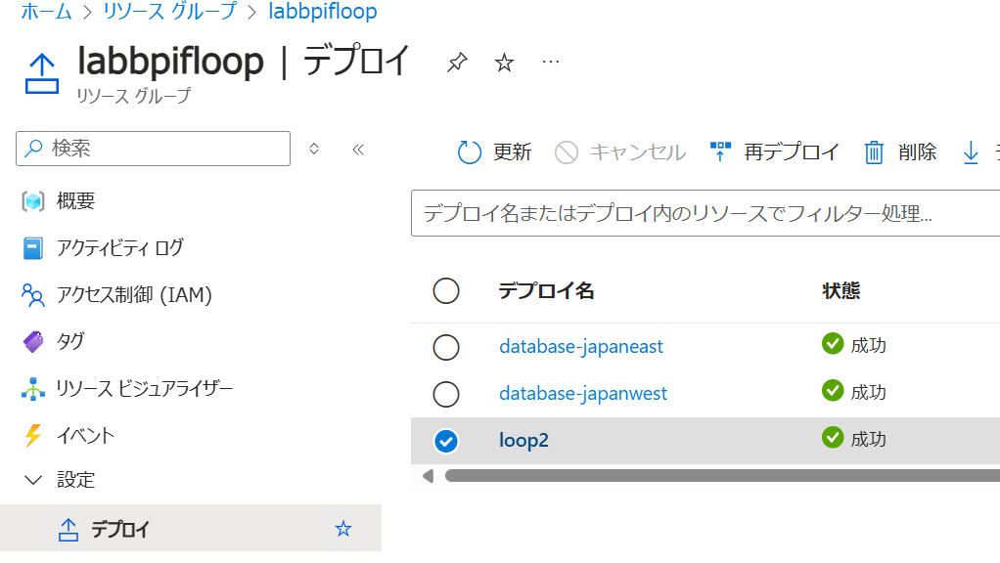
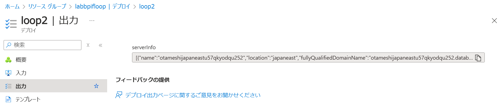

# デモ2

## このデモの目的

Azure Bicep の条件と反復ループの構文について紹介します。

## デモ2-1: 条件分岐

Azure Bicep では、`if` キーワードを使って条件分岐を行うことができます。
下記の例では、```environmentName == 'Production'``` が評価され、その結果 (Bool 値) が ```auditingEnabled``` に代入されます。
その ```auditingEnabled``` の値によって、Azure SQL Database の監査設定を有効化するかどうかを決定します。

```bicep
@description('The name of the environment. This must be Development or Production.')
@allowed([
  'Development'
  'Production'
])
param environmentName string = 'Production'
var auditingEnabled = environmentName == 'Production' // this variable has boolean value.

resource auditStorageAccount 'Microsoft.Storage/storageAccounts@2023-05-01' = if (auditingEnabled) {
  name: auditStorageAccountName
  location: location
  sku: {
    name: auditStorageAccountSkuName
  }
  kind: 'StorageV2'  
}
```

条件分岐は、`?` 演算子を使って、以下のようにも記述できます。

```bicep
resource sqlServerAudit 'Microsoft.Sql/servers/auditingSettings@2024-05-01-preview' = if (auditingEnabled) {
  parent: sqlServer
  name: 'default'
  properties: {
    state: 'Enabled'
    storageEndpoint: environmentName == 'Production' ? auditStorageAccount.properties.primaryEndpoints.blob : ''
    storageAccountAccessKey: environmentName == 'Production' ? auditStorageAccount.listKeys().keys[0].value : ''
  }
}
```

それでは、実際に２通りでデプロイして、動作を確認します。
初めに、```param environmentName string = 'Production'``` で指定された値を使用してデプロイします。この場合、```auditingEnabled``` は ```true``` となり、Azure SQL Database の監査設定が有効化されます。

```bash
$ az deployment group create --resource-group <RESOURCE_GROUP_NAME> --template-file if.bicep
```

Azure SQL Database に監査設定が追加されていることを確認します。




確認が済んだら対象リソース グループを削除します (オプション)。

```bash
$ az group delete --name <RESOURCE_GROUP_NAME> --no-wait --yes
```

---

次に対象パラメータを ```Development``` に変更してデプロイします。
この場合、```auditingEnabled``` は ```false``` となり、Azure SQL Database の監査設定は有効化されません。


```bash
$ az deployment group create --resource-group <RESOURCE_GROUP_NAME> --template-file if.bicep --parameters environmentName=Development
```

Azure SQL Database に監査設定が追加されていないことを確認します。



確認がとれましたら、リソース グループを削除します (オプション)。

```bash
$ az group delete --name <RESOURCE_GROUP_NAME> --no-wait --yes
```

## デモ2-2: 反復ループ

Azure Bicep では、`for` キーワードを使って反復ループを行うことができます。
配列の他にも、辞書オブジェクトを用いることも可能です。
さらに、先ほどの条件分岐と組み合わせて、複雑なリソースの展開も可能です。

```bicep
@description('The Azure regions into which the resources should be deployed.')
param locations array = [
  'japaneast'
  'japanwest'
]

resource vnets 'Microsoft.Network/virtualNetworks@2024-05-01' = [for location in locations: {
  name: 'vnet-${location}'
  location: location
  properties: {
    addressSpace: {
      addressPrefixes: [
        virtualNetworkAddressPrefix
      ]
    }
    subnets: subnetProperties
  }
}]
```

それでは、実際にデプロイして、動作を確認します。

```bash
$ az deployment group create --resource-group <RESOURCE_GROUP_NAME> --template-file loop.bicep
```

確認がとれましたら、リソース グループを削除します (オプション)。

```bash
$ az group delete --name <RESOURCE_GROUP_NAME> --no-wait --yes
```

この反復ループは、出力 (output) にも適用できます (```loop2.bicep``` を参照)。

```bicep
output serverInfo array = [for i in range(0, length(locations)): {
  name: databases[i].outputs.serverName
  location: databases[i].outputs.location
  fullyQualifiedDomainName: databases[i].outputs.serverFullyQualifiedDomainName
}]
```

デプロイ後の出力結果の確認は、Azure ポータルの他に、Azure CLI でも可能です。




```bash
$ az deployment group show -g <RESOURCE_GROUP_NAME> -n loop2 --query properties.outputs.serverInfo
{
  "type": "Array",
  "value": [
    {
      "fullyQualifiedDomainName": "otameshijapaneastu57qkyodqu252.database.windows.net",
      "location": "japaneast",
      "name": "otameshijapaneastu57qkyodqu252"
    },
    {
      "fullyQualifiedDomainName": "otameshijapanwestu57qkyodqu252.database.windows.net",
      "location": "japanwest",
      "name": "otameshijapanwestu57qkyodqu252"
    }
  ]
}
```

以上でデモ2は終了です。