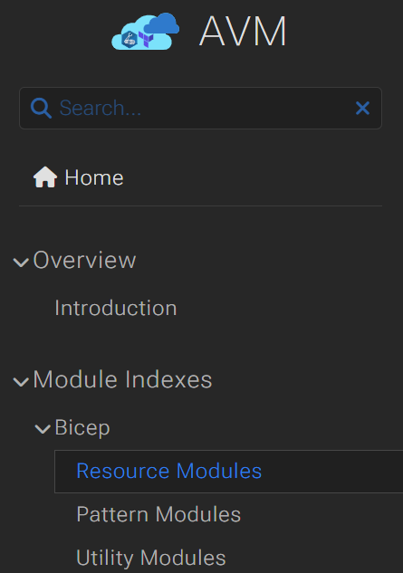
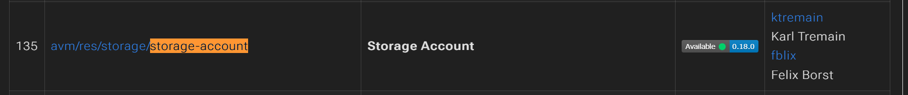

# デモ 3

## このデモの目的

以下の内容について理解を深めます。

* ローカル モジュールの利用
* Azure Container Registry にて Bicep モジュールを管理
* Azure Container Registry にあるリモート モジュールを使用してリソースをデプロイ
* AVM にあるリモート モジュールを使用してリソースをデプロイ

## デモ3-1: ローカル モジュールの作成

ファイルの配置は以下のようになっています。

```bash
│  main.bicep
│  
└─modules
        appgw.bicep
        website.bicep
```

この場合、```main.bicep``` から ```website.bicep``` と ```appgw.bicep``` を呼び出せます。

```bicep
module website './modules/website.bicep' = {
  name: 'otameshi-website'
  params: {
    appServiceAppName: appServiceAppName
    appServicePlanName: appServicePlanName
    appServicePlanSkuName: appServicePlanSkuName
  }
}

module appgw './modules/appgw.bicep' = {
  name: 'otameshi-appgw'
  params: {
    applicationGatewayName: applicationGatewayName
    appServiceFqdn: website.outputs.appServiceAppHostName
  }
}
```

```bash
$ az group create --name <RESOURCE_GROUP_NAME> --location japaneast
$ az deployment group create --resource-group <RESOURCE_GROUP_NAME> --template-file .\modules\website.bicep
```

デプロイ結果を確認し、リソースが作成されていることを確認します。
確認ができましたら、リソース グループを削除します (オプション)。

```bash
$ az group delete --name <RESOURCE_GROUP_NAME> --no-wait
```

## デモ3-2: リモート モジュールの利用

次に、リモートにて管理されているモジュールを利用します。
リモート モジュールの利用としては、公開されているモジュール (AVM: Azure Verified Modules) リポジトリ、
もしくは、Azure Container Registry (ACR) にプッシュされたモジュールを利用することができます。

Azure Container Registry (ACR) を作成し、モジュールファイル (```website.bicep``` と ```appgw.bicep```) をプッシュします。
まずは、ACR をデプロイします。

```bash
$ az group create --name <RESOURCE_GROUP_NAME> --location japaneast
$ az acr create --resource-group <RESOURCE_GROUP_NAME> --name <ACR 名はグローバルで一意になる必要があります> --sku Basic --location japaneast
$ az acr repository list --name <registry-name>
[]
```

次に、モジュールファイルを ACR にプッシュします。

```bash
$ az bicep publish --file .\modules\website.bicep --target 'br:<registry-name>.azurecr.io/website:v1'
$ az bicep publish --file .\modules\appgw.bicep --target 'br:<registry-name>.azurecr.io/appgw:v1'
$ az acr repository list --name <registry-name>           
[
  "appgw",
  "website"
]
$ az acr repository show-tags -n <registry-name> --repository appgw --output tsv
v1
$ az acr repository show-tags -n <registry-name> --repository website --output tsv
v1
```

それでは、リモート モジュールを利用してリソースをデプロイします。
なお、リモートモジュールを参照する Bicep ファイルでは、以下のような書式となります。
Bicep ファイルで記載すると、Bicep 拡張機能により、ローカルへのコピー ([bicep restore](https://learn.microsoft.com/ja-jp/azure/azure-resource-manager/bicep/bicep-cli#restore)) が行われます。

```bicep
module website 'br:<registry-name>.azurecr.io/website:v1' = {
  name: 'otameshi-website'
  params: {
    appServiceAppName: appServiceAppName
    appServicePlanName: appServicePlanName
    appServicePlanSkuName: appServicePlanSkuName
    location: location
  }
}

module appgw 'br:<registry-name>.azurecr.io/appgw:v1' = {
  name: 'otameshi-appgw'
  params: {
    applicationGatewayName: applicationGatewayName
    appServiceFqdn: website.outputs.appServiceAppHostName
  }
}
```

```bash
$ az deployment group create --resource-group <RESOURCE_GROUP_NAME> --template-file .\main2.bicep
```

デプロイ結果を確認し、リソースが作成されていることを確認します。
確認ができましたら、リソース グループを削除します (オプション)。

```bash
$ az group delete --name <RESOURCE_GROUP_NAME> --no-wait
```

## デモ3-3: AVM

[Azure Verified Modules (AVM)](https://azure.github.io/Azure-Verified-Modules/indexes/bicep/) は、Azure によって検証されたベスト プラクティスを含む、
再利用可能なモジュールのセットです。こちらにあるモジュールを使ってデプロイして見ましょう。

対象モジュールで指定可能なバージョンなどの情報は、拡張機能によって取得されますが、
AVM のポータル上でも確認いただくことが可能です。




```bicep
module storage 'br/public:avm/res/storage/storage-account:0.18.0' = {
  name: 'myStorageAccount'
  params: {
    name: 'sa${resourceGroup().name}'
  }
}
```

デプロイ結果を確認し、リソースが作成されていることを確認します。
確認ができましたら、リソース グループを削除します (オプション)。

```bash
$ az group delete --name <RESOURCE_GROUP_NAME> --no-wait
```

以上でデモ3は終了です。