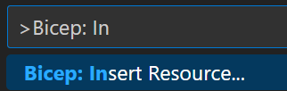
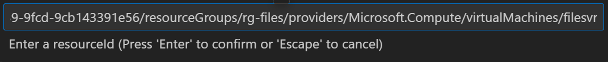
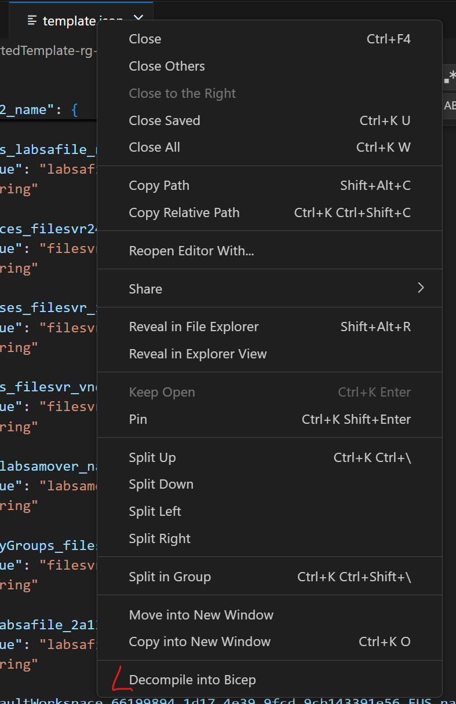

# デモ 4

## このデモの目的

* VS Code にて既存リソースの Bicep ファイルへのデコンパイル
* ダウンロードした ARM テンプレートを Bicep ファイルへデコンパイル

## デモ 4-1: 既存リソースの Bicep ファイルへのデコンパイル

VS Code の設定 (左下歯車マークを選択) から Command Palette を選択するか、
`Ctrl + Shift + P` を押して Command Palette を開きます。
そして "Bicep: Insert Resurce" を選択します。

次に、デコンパイル先の Bicep ファイルを選択します。

Bicep に変換されたい既存の Azure リソース ID を入力します (リソース ID の参照方法は、[こちら](https://jpaztech.github.io/blog/information/Subscription-ID-verification/#%E3%83%AA%E3%82%BD%E3%83%BC%E3%82%B9-ID-%E3%81%AE%E7%A2%BA%E8%AA%8D%E6%96%B9%E6%B3%95%E3%81%AB%E3%81%A4%E3%81%84%E3%81%A6) を参照してください)。

## デモ 4-2: ダウンロードした ARM テンプレートを Bicep ファイルへデコンパイル

今度は、ダウンロードした ARM テンプレートを Bicep ファイルへデコンパイルします。
Azure ポータルより対象の ARM テンプレートをエクスポートします ([こちら](https://learn.microsoft.com/ja-jp/azure/azure-resource-manager/templates/export-template-portal) を参照してください)。
次いで、VS Code で対象 JSON ファイルを開き、右クリックして "Decompile into Bicep" を選択します。

Bicep ファイルが生成されます。

以上でデモ4は終了です。