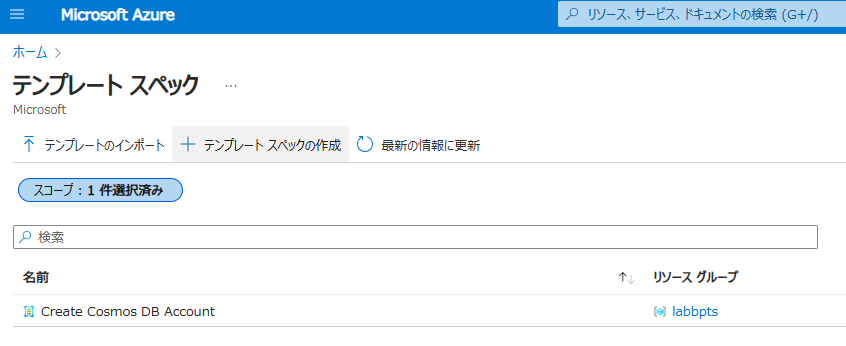

# デモ 5

## このデモの目的

* テンプレート スペックの作成と公開
* テンプレート スペックから Bicep ファイルのデプロイ
* テンプレート スペックの更新

## デモ 5-1: テンプレート スペックの作成と公開

```bash
$ az group create --name <RESOURCE_GROUP_NAME> --location japaneast
$ az ts create --resource-group <RESOURCE_GROUP_NAME> --name cosmosdb --location japaneast --display-name "Create Cosmos DB Account" --description "This template spec creates a Cosmos DB account that meets our company's requirements." --version 1.0 --template-file main.bicep 
```



作成したテンプレート スペックよりデプロイしてみます。

```bash
# テンプレート スペックの ID を取得
$ az ts show --resource-group labbpts --name cosmosdb --version "1.0" --query "id"
# 取得したテンプレート スペックの ID を使ってデプロイ
$ az deployment group create --resource-group <RESOURCE_GROUP_NAME> --template-spec <TEMPLATE_SPEC_ID>
```

## デモ 5-2: テンプレート スペックの更新

次に、テンプレート スペックを更新してみます。
それに先立ち、対象のテンプレート スペックを取得します。

```bash
$ az ts create --resource-group <RESOURCE_GROUP_NAME> --name cosmosdb --version 2.0 --template-file update.bicep  
```

なお、既存のバージョンを指定した場合、それを置き換えるかどうかを確認されます。

```bash
az ts create --resource-group <RESOURCE_GROUP_NAME> --name cosmosdb --version 1.0 --template-file .\workshopdemo\demo5\update.bicep     
This will override template spec cosmosdb version 1.0. Proceed? (y/n): n
```

確認ができましたら、リソース グループを削除します (オプション)。

```bash
$ az group delete --name <RESOURCE_GROUP_NAME> --no-wait
```

以上でデモ5は終了です。