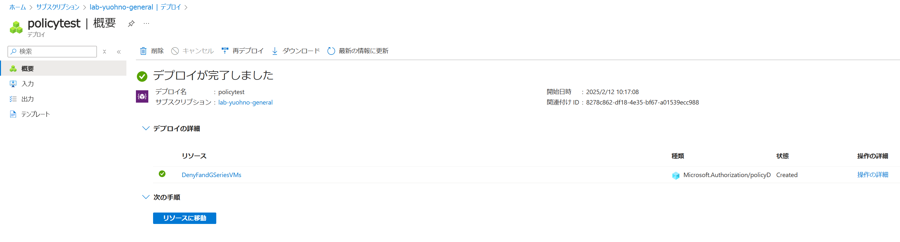
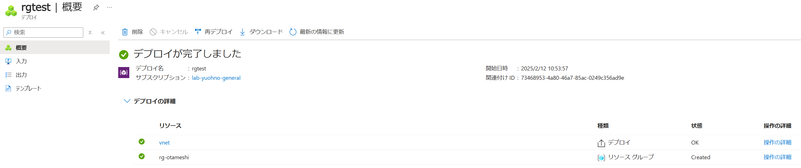

# デモ 6

## このデモのゴール

* スコープを使ってサブスクリプション スコープでリソースを展開

## デモ 6-1: スコープを使ってサブスクリプション スコープでリソースを展開

このスコープで Bicep を使うシナリオとしては、下記の点になるかと思います。

* リソース グループを作成
* サブスクリプション内のすべてのリソースに対して権限を付与
* Azure Policy の作成、付与

ここでは カスタムの Azure Policy を定義し、サブスクリプション スコープで展開します。
展開するに当たっては、```az deployment sub create``` コマンドを使用します。

```bash
$ az deployment sub create --name policytest --location japaneast --template-file subscription.bicep
```



確認が取れましたら、対象の Azure Policy とその割り当てを削除します。

```bash
$ az policy definition delete --name 'DenyFandGSeriesVMs' --subscription <SUBSCRIPTION_ID>
```

## デモ 6-2: 

次にリソース グループを作って、その中にリソースを展開します。
ここでは、後続で作成している仮想ネットワークのリソース内にて、
 ```scope``` 関数を用いて展開するリソース グループを指定します。

```bash
$ az deployment sub create --name rgtest --location japaneast --template-file resourcegroup.bicep
```



確認ができましたら、リソース グループを削除します (オプション)。

```bash
$ az group delete --name rg-otameshi --no-wait
```

以上でデモ6は終了です。