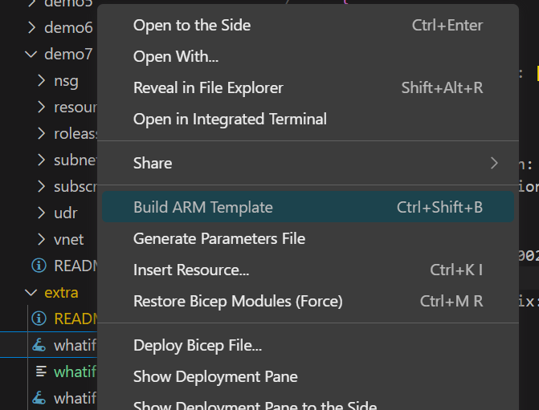

デモでは扱わなかったトピックについて補足します。

* What-If デプロイメント
* PSRule V2

## "Deploy to Azure" ボタン

ここでは、以下の "Deploy to Azure" ボタンを使用して、Azure リソースをデプロイする方法を説明します。


[]

### 作り方

> **Warning**
>このボタンは、Azure Portal で ARM テンプレートをデプロイするためのものです。Bicep ファイルを直接デプロイすることはできません。

1. Azure Bicep テンプレートを ARM テンプレートに変換します。

Visual Studio Code で対象 Bicep ファイルを右クリックし、"Build ARM Template" を選択します。
これにより、ARM テンプレートが生成されます。



2. 次にその ARM テンプレートを GitHub リポジトリにコミットするか、Azure Storage アカウントにアップロードします。

2. テンプレートの URL を取得し、それをエンコードします。
例として、GitHub リポジトリにある、```https://github.com/Azure/azure-quickstart-templates/blob/master/quickstarts/microsoft.storage/storage-account-create/azuredeploy.json``` をエンコードします。

```powershell
PS C:\Users\user1> $url = "https://raw.githubusercontent.com/Azure/azure-quickstart-templates/master/quickstarts/microsoft.storage/storage-account-create/azuredeploy.json"
PS C:\Users\user1> [uri]::EscapeDataString($url)
https%3A%2F%2Fraw.githubusercontent.com%2FAzure%2Fazure-quickstart-templates%2Fmaster%2Fquickstarts%2Fmicrosoft.storage%2Fstorage-account-create%2Fazuredeploy.json
```

3. 上記のエンコードした URL を、"Deploy to Azure" ボタンのリンクに設定します。その際に、先のエンコードした URL を ```https://portal.azure.com/#create/Microsoft.Template/uri/``` の後ろに追加しその URL を用います。

```markdown
[](https://portal.azure.com/#create/Microsoft.Template/uri/https%3A%2F%2Fraw.githubusercontent.com%2FAzure%2Fazure-quickstart-templates%2Fmaster%2Fquickstarts%2Fmicrosoft.storage%2Fstorage-account-create%2Fazuredeploy.json)
```

[](https://portal.azure.com/#create/Microsoft.Template/uri/https%3A%2F%2Fraw.githubusercontent.com%2FAzure%2Fazure-quickstart-templates%2Fmaster%2Fquickstarts%2Fmicrosoft.storage%2Fstorage-account-create%2Fazuredeploy.json)